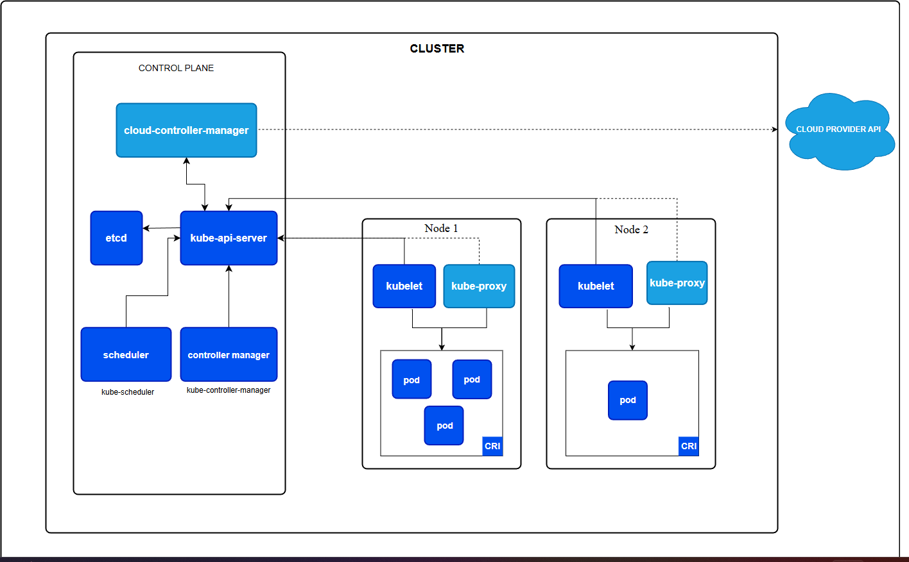

# ☸️ Kubernetes (K8s) Notes

### **What is Kubernetes?**
* **K8s:** Often called "K8s" because there are **8 letters** between the 'K' and 's' in "Kubernetes."
* **Type:** An open-source **Container Orchestration** platform.
* **Origin:** Developed by Google (Borg) and now maintained by the CNCF.
* **Scale:** It manages a **Cluster** rather than a single host.

---

### **🚀 Problems K8s Fixes**

* **Single Host Limitation:** In plain Docker, if your one host fails, everything goes down. **K8s uses a Cluster**, so if one node crashes, it automatically moves your work to a healthy node.
* **No Auto-Healing:** K8s has a "Self-Healing" feature. It constantly monitors your Pods; if one fails or becomes unresponsive, K8s kills it and starts a fresh one to maintain your desired state.
* **Manual Scaling:** Instead of manually spinning up containers during high traffic, K8s uses the **Horizontal Pod Autoscaler (HPA)** to scale up (add pods) or scale down (remove pods) automatically based on CPU/RAM usage.
* **Enterprise Support:** K8s provides out-of-the-box support for production-grade needs like:
    * **Load Balancing:** Distributing traffic across pods.
    * **Firewalls/Network Policies:** Controlling traffic flow between services.
    * **API Gateways/Ingress:** Managing external access to the cluster.

---

### **🥊 Docker vs. Kubernetes**
**Docker** is the **Box** (the container); **Kubernetes** is the **Crane/Manager** at the port that decides where the boxes go.

| Feature | Docker (Container Platform) | Kubernetes (Orchestration) |
| :--- | :--- | :--- |
| **Main Goal** | Package and run an app. | Manage containers across many servers. |
| **Scope** | Single Host (One machine). | Cluster (Multiple machines). |
| **Auto-Healing** | No. If it dies, it stays dead. | Yes. Restarts failed containers. |
| **Scaling** | Manual. | Automatic (HPA). |
| **Networking** | Basic. | Advanced (Load Balancing/Discovery). |

---

### **🏗️ What is a Cluster?**
A **Cluster** is a set of "Node" machines (physical or virtual) that work together as a single unit. Instead of deploying to one server, you deploy to the cluster.
* **Analogy:** Like a **Fleet of Ships**. You don't care which ship carries your container; you just want the fleet to get it delivered. If one ship sinks, the others pick up the load.

---

### **📦 The Hierarchy: From Container to Cluster**

Kubernetes follows a nested structure. To understand where the container sits, think of it like this:

* **Cluster (The Fleet):** The entire collection of Nodes and the Control Plane working together as one giant system.
* **Node (The Ship):** The individual machine (server/EC2) in the cluster. This is the **"Hardware"** that provides the CPU and RAM.
* **Pod (The Crate):** The smallest unit K8s manages. It is a **wrapper** around one or more containers. K8s moves Pods, not containers.
* **Container (The Goods):** Your actual application (the Docker image). Like the rice or electronics inside a crate, the container lives inside the Pod.

**Logical Relation:** **Container** ⊂ **Pod** ⊂ **Node** ⊂ **Cluster**

---

### **Simplified Summary**
| Level | Name | Analogy | Description |
| :--- | :--- | :--- | :--- |
| **Level 1** | **Container** | The Goods | The actual app code/image. |
| **Level 2** | **Pod** | The Crate | The smallest unit K8s can "see" and move. |
| **Level 3** | **Node** | The Ship | The physical/virtual machine running the Pods. |
| **Level 4** | **Cluster** | The Fleet | The whole system managed by the Control Plane. |

---

### **The Architecture: Master vs. Worker**

#### **1. Master Node (Control Plane)**
* **API Server:** The entry point/Heart. All requests go here.
* **Scheduler:** Decides **which** Worker Node should run a Pod.
* **etcd:** Key-Value Store that holds the cluster's entire state.
* **Controller Manager:** Enforces the "Desired State" (e.g., ensuring 3 pods stay running).(diff for each cloud provider)
* **Cloud Control Manager (CCM):** Bridge to AWS/Azure/GCP.

#### **2. Worker Node (Data Plane)**
* **Container Runtime:** The engine that runs containers (Dockershim, containerd, CRI-O, etc.).
* **Kubelet:** The captain of the node; ensures Pods are healthy(managing the nodes).
* **Kube-Proxy:** The network guy; handles IP addresses and Load Balancing.